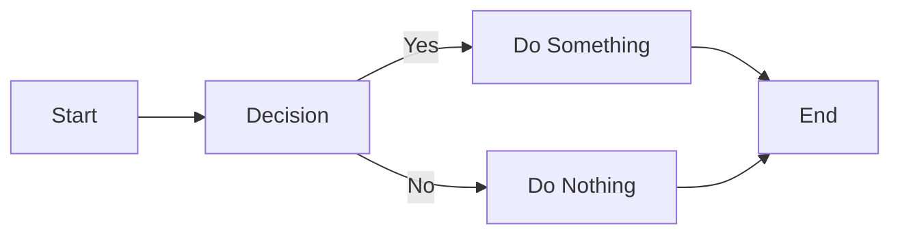
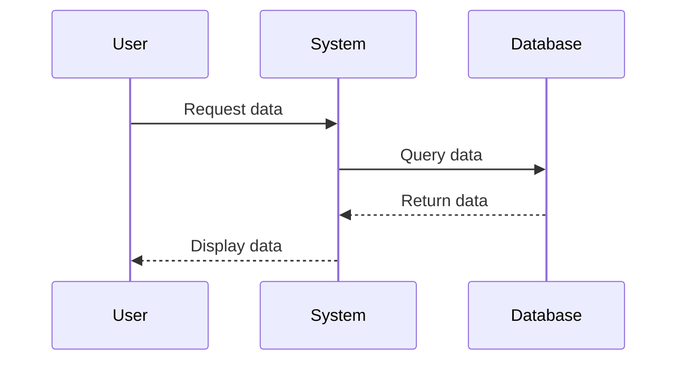
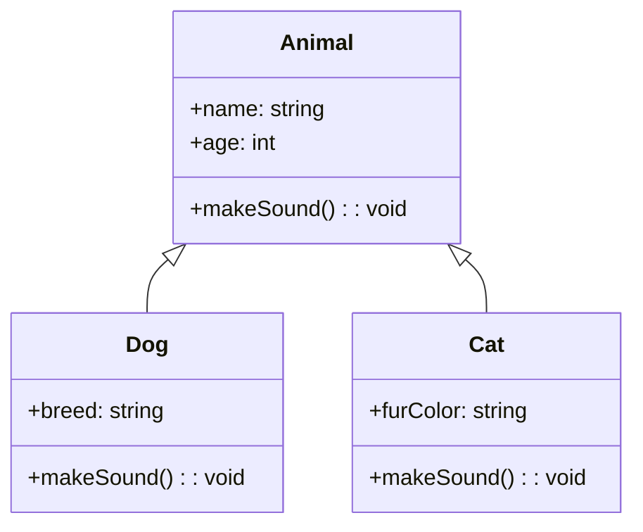
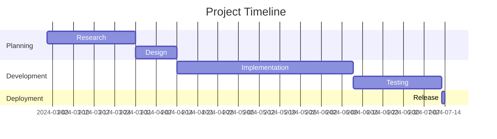

# Testing Mermaid Diagrams in Markdown

This page demonstrates how Mermaid diagrams can be included in Markdown content.

## Flowchart Example

## Sequence Diagram Example

## Class Diagram Example

## Gantt Chart Example

