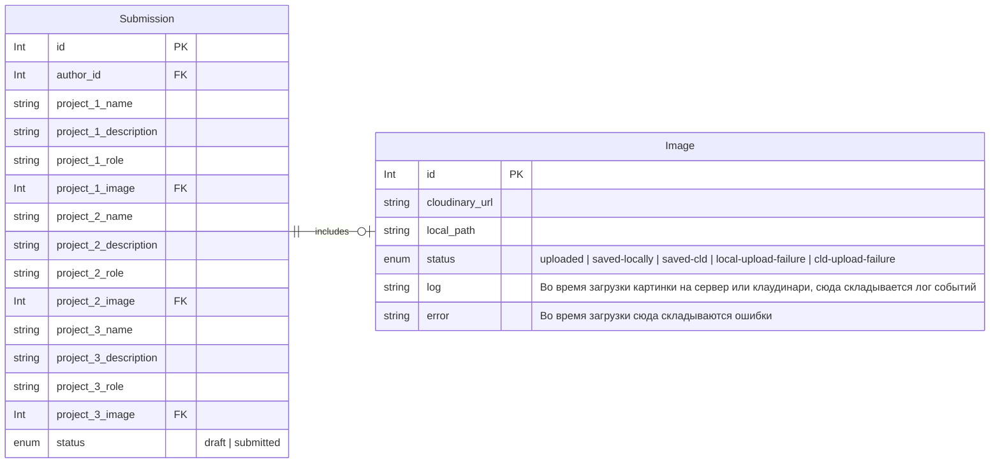

# Бэк для чекапа

## БД

- Добавить сущности в призму
- Создать миграцию
- Показать Мише
- Запустить на dev
- profit

## Эндпоинты
### Черновик
- сохранить в бд состояние формы

### Сабмит
- обновить у записи все поля на то, что только что пришло с сервера
- поставить флаг "засабмичено"

### Загрузка картинки
*На протяжении всех процессов, вести лог в запись в **бд***

- создать запись в бд
- создать временный файл, использовать в качестве имени id из бд с префиксом
- вернуть на страницу id
- загрузить файл как и сейчас они грузятся
- поставить статус "сохранено локально"
- отдать ответ что успешно сохраено
- запустить в бэкграунде загрузку картинки в клаудинари
- после того как загрузилось в клаудинари, обновить статус в бд

#### JOB проверки картинок
- Найти файлы, которые успешно загрузились в CLD
- Удалить локальные файлы
- Найти файлы, загрузка которых провалилась
- Добавить в бд счетчик попыток
- Запустить загрузку картинки в CLD

## Изменение поведения
При загрузке формы,
- проверять залогинен ли пользователь.
- проверять статус записи в бд и не пускать на страницы формы, на которые нельзя.
Если заявки нет, показывать кнопку "начать заполнять анкету", это создает черновик и переправляет на страницу формы
Если заявка есть и она в статусе draft, показать форму
Если заявка есть и в статусе submitted, показать финальный экран
