# Интеграция Vite во фронтенд OneVizion

## Описание

Заменяю gulp и вообще всё подключение скриптов и стилей на vite. Это дает нам:

- Hot Module Replacement (HMR)
- Корректную сборку с tree-shaking и code splitting
- Автоматический сброс кеша через хеши в именах файлов
- Сборку CSS вместе с JS

## Начальная архитектура

### Dev режим

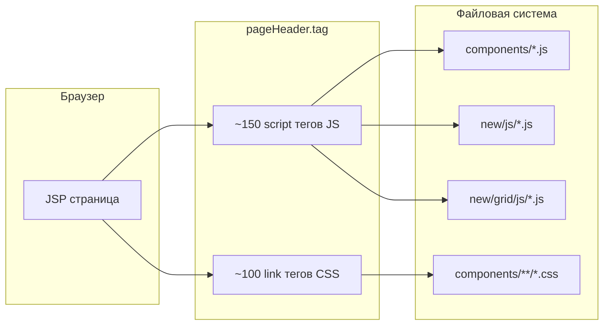

### Prod режим: сборка

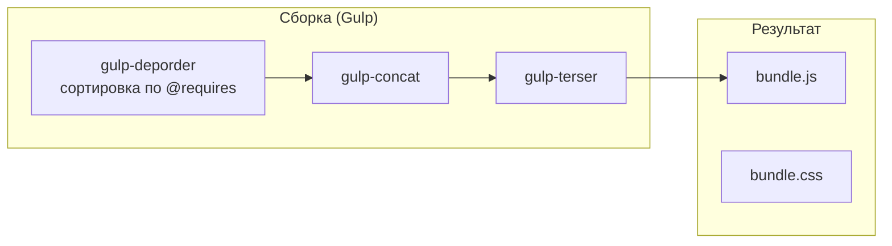

### Prod режим: запросы

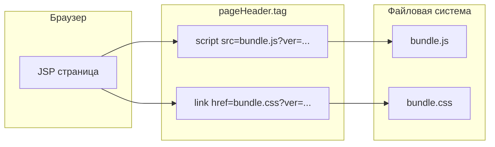

**Проблемы (решаемые):**

- Кастомный скрипт сборки для продакшена
- Нет HMR, полная перезагрузка страницы при изменениях
- Параметр версии для сброса кеша (легко устаревает)

**Проблемы (отложены на будущее):**

- Ручной контроль порядка скриптов
- Загрязнение глобальной области видимости (все классы на window)

## Итоговая архитектура

### Dev режим

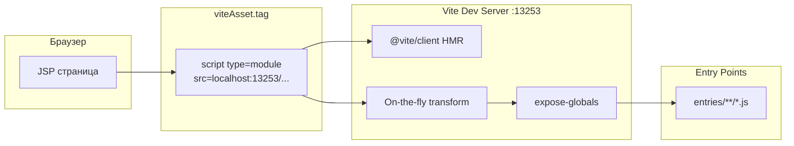

### Prod режим: сборка

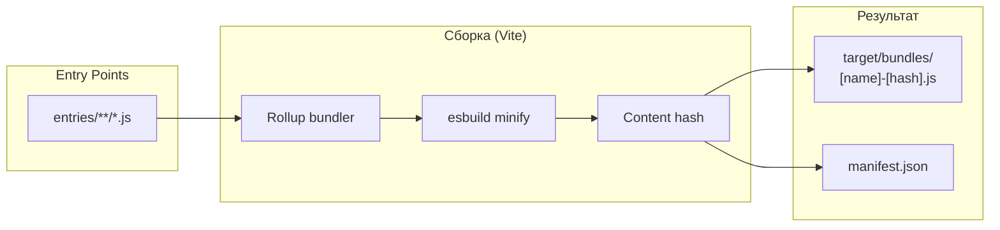

### Prod режим: запросы

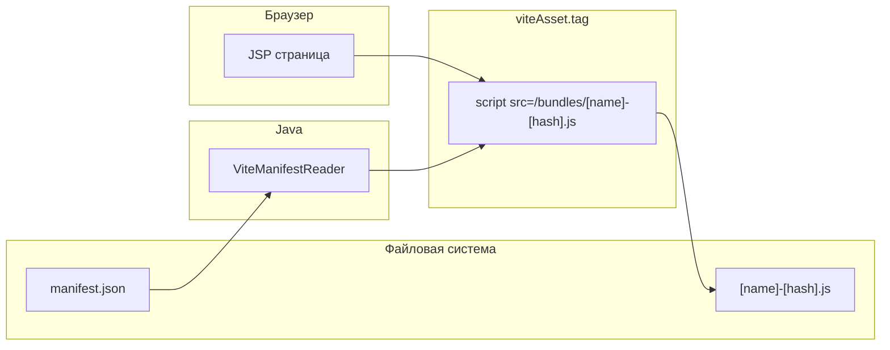

## Ключевые компоненты

### Структура Entry Points

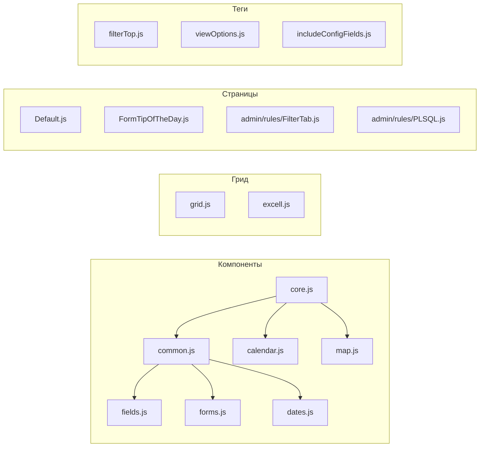

### Добавленные файлы

| Файл                                | Назначение                                            |
| ----------------------------------- | ----------------------------------------------------- |
| `web/vite.config.js`                | Конфигурация Vite с entry points и плагинами          |
| `web/vite-plugin-expose-globals.js` | AST-плагин для экспорта классов в window              |
| `web/tsconfig.json`                 | TypeScript конфиг для поддержки IDE                   |
| `ViteDevModeHolder.java`            | Spring bean для определения dev режима                |
| `ViteManifestReader.java`           | Парсит manifest.json для путей к ассетам в продакшене |
| `viteAsset.tag`                     | JSP тег для подключения Vite ассетов                  |
| `entries/**/*.js`                   | Entry points бандлов с импортами                      |

### Процесс в Dev режиме

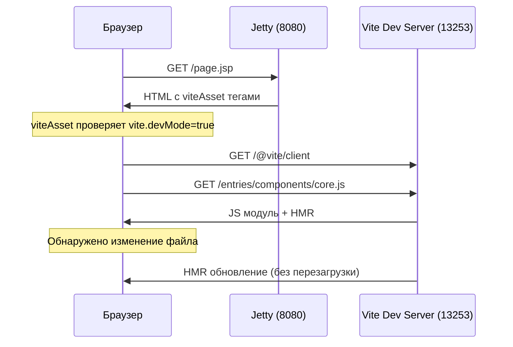

### Процесс сборки для продакшена

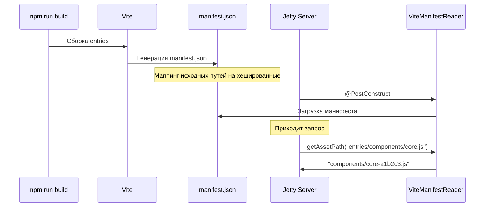

## Роль Gulp в миграции

Gulp используется для генерации entry point файлов, которые затем обрабатываются Vite.

### Старая сборка через Gulp (до миграции)

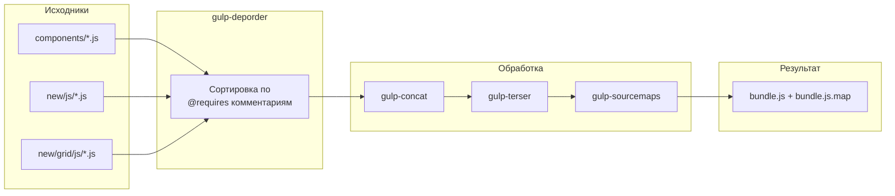

**Проблемы старого подхода:**

- `gulp-deporder` требовал ручных `@requires` комментариев в каждом файле
- Один монолитный бандл без code splitting
- Невозможность tree-shaking
- Sourcemaps работали ненадежно

### Новая роль Gulp (генерация entry points)

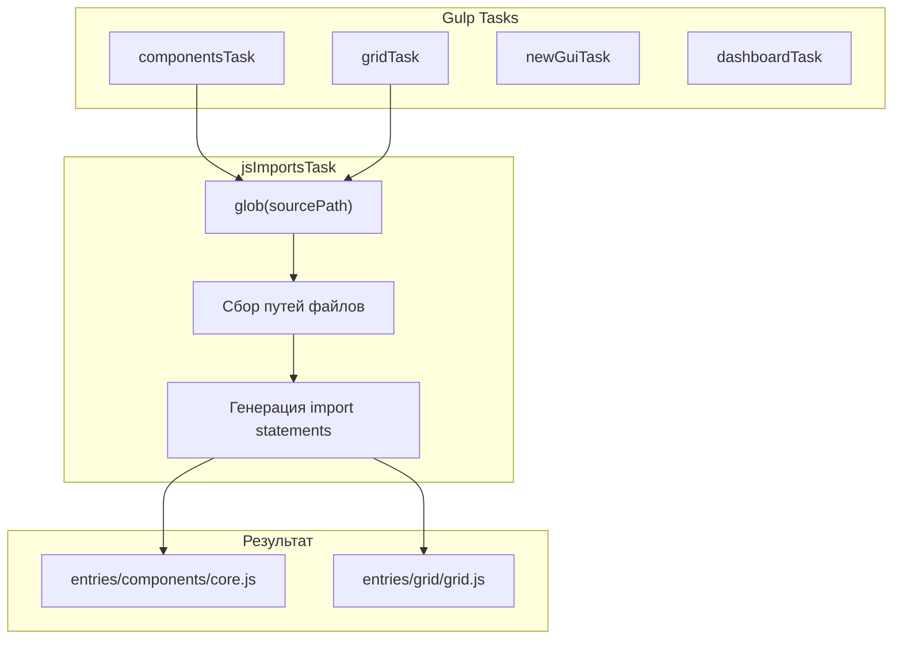

### Пример генерации entry point

**Вход:** glob `components/mixins/**/*.js`

**Выход:** `entries/components/core.js`

```javascript
import './core.css';
import '../../components/Component.js';
import '../../components/mixins/ButtonMixins.js';
import '../../components/mixins/ChatMixin.js';
import '../../components/mixins/DisableMixin.js';
// ... остальные импорты
```

### Структура Gulp задач

```
gulp/
  gulpfile.mjs              # Главный файл: parallel(componentsTask, gridTask, ...)
  tasks/
    componentsTask.mjs      # 15 подзадач: core, common, calendar, map, ...
    gridTask.mjs            # grid.js, excell.js
    newGuiTask.mjs          # newGui.js
    dashboardTask.mjs       # dashboard.js
    common/
      jsImportsTask.mjs     # Генерирует JS с import statements
      cssImportsTask.mjs    # Генерирует CSS с @import statements
      jsTask.mjs            # Старый: concat + terser (не используется)
```

### Сравнение подходов

| Аспект         | Старый Gulp           | Новый Gulp + Vite      |
| -------------- | --------------------- | ---------------------- |
| Задача Gulp    | Сборка бандла         | Генерация entry points |
| Порядок файлов | @requires комментарии | ES imports             |
| Минификация    | gulp-terser           | Vite (esbuild)         |
| Sourcemaps     | gulp-sourcemaps       | Vite (встроенные)      |
| HMR            | Нет                   | Да                     |
| Tree-shaking   | Нет                   | Да                     |

## Плагин expose-globals

Плагин решает проблему обратной совместимости, автоматически экспортируя классы в `window`:

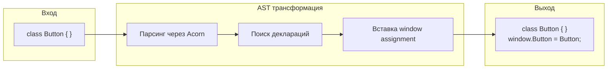

## Соотношение JSP/Tags и Entries

### Масштаб проекта

Скрипт миграции (`migrate-to-vite-entries.mjs`) анализирует все JSP/tag файлы и определяет какие скрипты требуют Vite bundling:

| Тип файлов        | Всего   | Требуют entry |
| ----------------- | ------- | ------------- |
| JSP страницы      | 614     | 21            |
| Tag файлы         | 91      | 8             |
| **Итого**         | **705** | **29**        |
| Vite entry points | -       | 48            |

Entry points больше чем JSP/tag потому что включают общие компоненты (Gulp) и conditional entries.

### Скрипт миграции

Скрипт автоматически:

1. Сканирует JSP/tag файлы на `<script src="...">` теги
2. Проверяет содержимое каждого скрипта на паттерны требующие Vite:
   - `class X extends Component`
   - `customElements.define`
   - `new C_*` компоненты
3. Учитывает JSTL conditional блоки (`<c:if>`, `<c:when>`)
4. Генерирует entry файлы с импортами
5. Заменяет `<script>` теги на `<ps:viteAsset>`

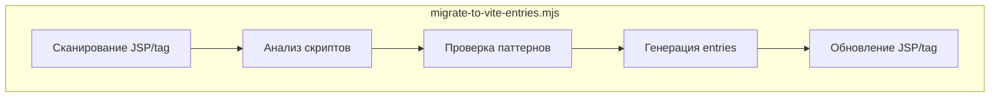

### Типы entry points

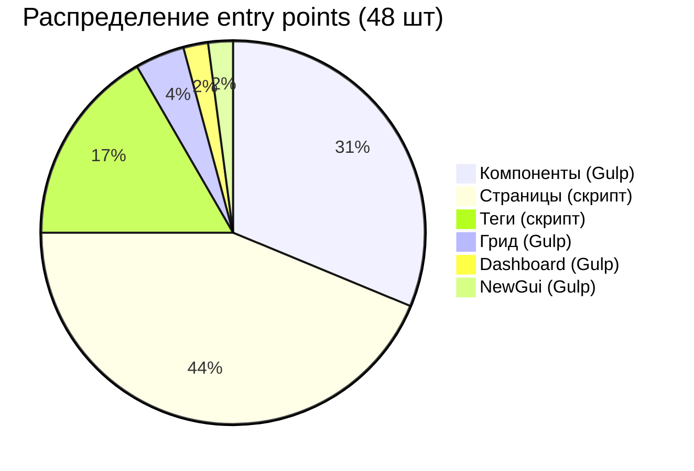

### Иерархия entries

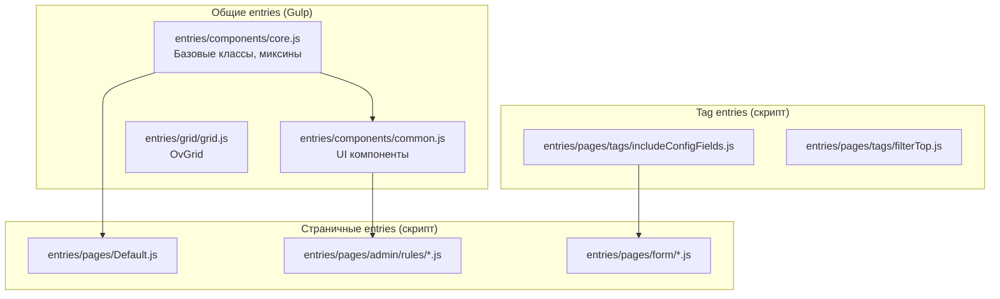

### Как JSP/Tag соотносится с Entry

**До миграции** (includeConfigFields.tag):

```jsp
<script src="/components/configForm/cfields/AbstractCField.js?ver=${ver}"></script>
<script src="/components/configForm/cfields/CFieldText.js?ver=${ver}"></script>
<script src="/components/configForm/cfields/CFieldNumber.js?ver=${ver}"></script>
<!-- ... ещё 50+ script тегов -->
```

**После миграции** (includeConfigFields.tag):

```jsp
<ps:viteAsset src="entries/pages/tags/includeConfigFields.js"/>
```

**Entry point** (entries/pages/tags/includeConfigFields.js):

```javascript
import '../../../components/configForm/cfields/AbstractCField.js';
import '../../../components/configForm/cfields/CFieldText.js';
import '../../../components/configForm/cfields/CFieldNumber.js';
// ... все импорты в одном файле
```

### Типы entry points по назначению

| Категория      | Примеры                               | Генерация       | Назначение                         |
| -------------- | ------------------------------------- | --------------- | ---------------------------------- |
| **Компоненты** | `core.js`, `common.js`, `calendar.js` | Gulp            | Общие библиотеки для всех страниц  |
| **Страницы**   | `admin/rules/FilterTab.js`            | Скрипт миграции | JS специфичный для конкретной JSP  |
| **Теги**       | `tags/includeConfigFields.js`         | Скрипт миграции | JS для переиспользуемых tag-файлов |
| **Грид**       | `grid/grid.js`, `grid/excell.js`      | Gulp            | Компоненты грида                   |

### Покрытие миграцией

Из 705 JSP/tag файлов только 29 содержат скрипты требующие Vite bundling. Остальные либо:

- Используют только общие компоненты из `pageHeader.tag`
- Содержат только библиотечные скрипты (исключены из миграции)
- Не содержат скриптов вообще

## Статистика

| Метрика               | До               | После             |
| --------------------- | ---------------- | ----------------- |
| Изменено файлов       | -                | 191               |
| Добавлено строк       | -                | 6,665             |
| Удалено строк         | -                | 2,917             |
| Размер pageHeader.tag | ~500 строк       | ~65 строк         |
| HTTP запросов (dev)   | 100+             | ~20 entry чанков  |
| Сброс кеша            | параметр `?ver=` | Хеш в имени файла |

## Коммиты

1. `vite setup` - Начальная конфигурация Vite
2. `use gulp to generate entries` - Генерация entry points
3. `vite entries for everything` - Полное покрытие entry points
4. `css fix` - Исправления сборки CSS
5. `remove temporary bundle` - Удаление старого бандла
6. `vite assets` - Обработка ассетов
7. `cleanup` (x2) - Очистка кода
8. `page entries` - Entry points для страниц
9. `replacement WIP` - Обновление tag-файлов (в процессе)

## Интеграция с Maven/Jetty

Vite полностью интегрирован в Maven lifecycle - не нужно запускать отдельные процессы.

### Maven профили

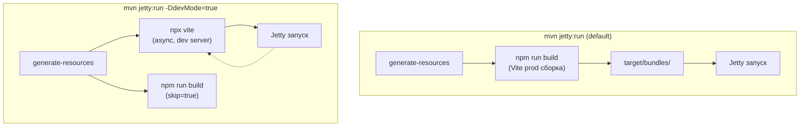

### Конфигурация в pom.xml

- **Dev профиль** (`-DdevMode=true`): запускает `npx vite` асинхронно в фазе `generate-resources`, устанавливает `vite.devMode=true`
- **Prod сборка** (по умолчанию): выполняет `npm run build` в фазе `generate-resources`, пропускается если `vite.devMode=true`

### Использование

**Разработка (с HMR):**

```bash
mvn jetty:run -DdevMode=true

# Vite dev server запускается автоматически на порту jetty+5173
# Например: Jetty 8080 -> Vite 13253
```

**Продакшен (со сборкой):**

```bash
mvn jetty:run

# Vite автоматически собирает бандлы в target/bundles/
# Jetty раздает их по пути /bundles/
```

### Передача параметров в Vite

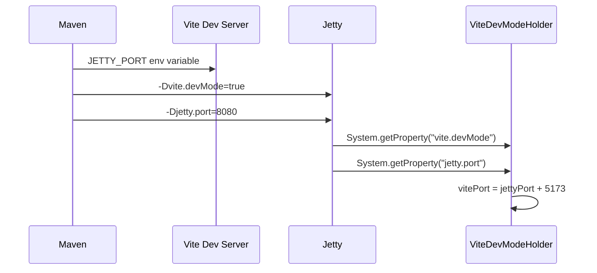
